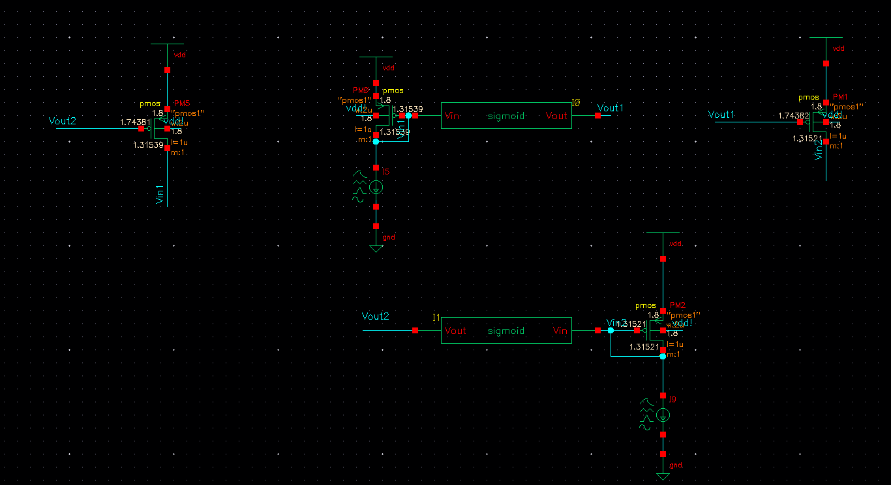

# Modeling-a-Symmetric-Neuron-network-with-Cadence
## The project I handled for the Neuromorphic Signal Processing Course
It consists in impleting in Julia as a first phase and designing a network of neurons made of fully analog transistors in Cadence as a second phase.
I Cannot share the design neither the implementation of the sigmoid block we used for this project since it has been done with other partners. Nevertheless, I can show you some interesting results and conclusions.

